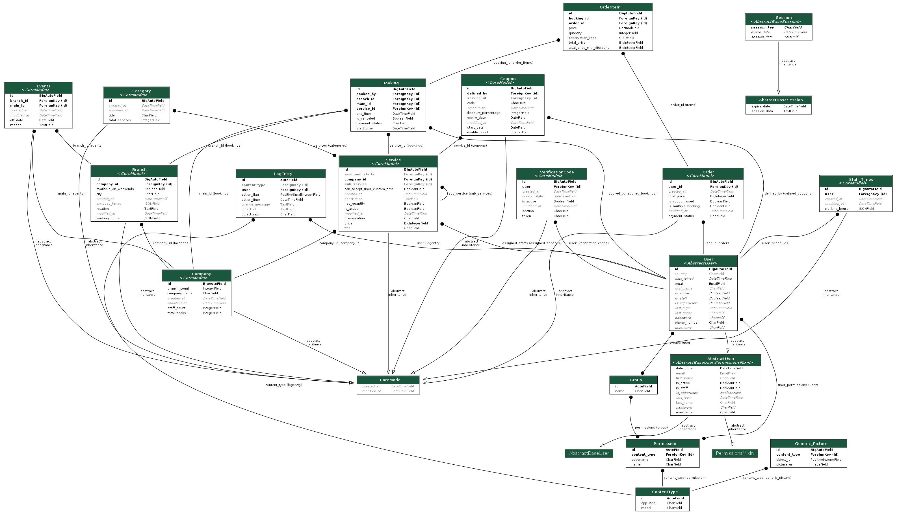

# 🐍 Django Appointment Booking 🗓️

## Overview
This project built upon Django with Docker for local development. Follow this instructions for setting up the project, building Docker images, running Django.

## Django Models Diagram

Models diagram generated by pydot , graphviz:



[//]: # (### 1. Install Dependencies)

[//]: # (Ensure all required Python packages are installed.)

[//]: # ()
[//]: # (```bash)

[//]: # (pip install -r requirements.txt)

[//]: # (```)

[//]: # (### 2. Docker Setup)

[//]: # (To build the Docker image:)

[//]: # ()
[//]: # (```bash)

[//]: # (docker build appointment-booking .)

[//]: # (```)

[//]: # (To run the Docker container:)

[//]: # ()
[//]: # (```bash)

[//]: # (docker run -p 8000:8000 appointment-booking)

[//]: # (```)

[//]: # (OR)

[//]: # ()
[//]: # (```bash)

[//]: # (docker-compose up -d)

[//]: # (```)

[//]: # ()
[//]: # (Access the project through this url:)

[//]: # ()
[//]: # (`http://localhost:8000/`)

[//]: # ()
[//]: # (### 3. Running the Django Project)

[//]: # (After running the Docker container, you can open the Django project at:)

[//]: # (```)

[//]: # (http://localhost:8000)

[//]: # (```)

## Running locally

### 1. Install Dependencies
Ensure all required Python packages are installed. Run the following command in your terminal:
```bash
pip install -r requirements.txt
```

### 2. Apply migrations

```bash
python manage.py makemigrations
```

and then

```bash
python manage.py migrate
```

### 3. Final step
Now with having these steps done you can easily access the project on your local

```bash
python manage.py runserver
```


